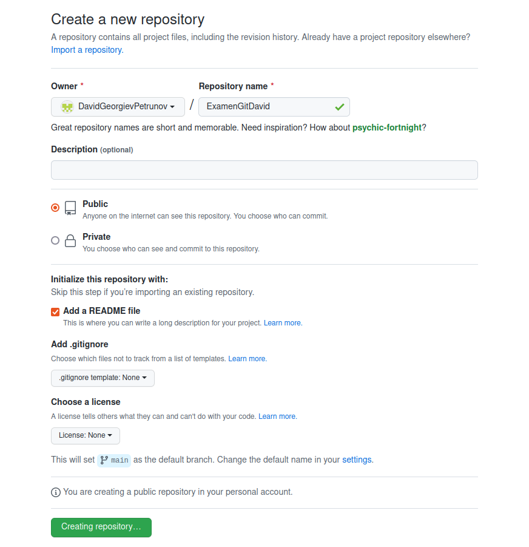
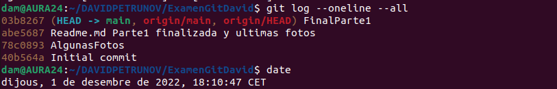

# ExamenGitDavid
# Creacion del repositorio

En la pagina clickamos el simbolo "+" y sale la opcion de "New repository"

Cuando clickamos esta opcion saldra esta pantalla donde añadimos el nombre y el readme.md

Se creara un repositorio y en el clickaremos Code y lo copiaremos para luego clonar el repositorio

# Primeros Comandos; CLONE

Haremos el git init para inicializar un repositorio

Ahora usamos el clone para clonar el repositorio en nuestra area de trabajo

Aqui esta una imagen del repositorio clonado con las imagenes que he echo hasta ahora y el Readme.md

# Primeros Comandos; Haciendo Status, Add, Commit, Log y Push

Ahora haremos un status donde mostrara las imagenes que estaban en la carpeta sin subir al repositorio

Ahora hacemos un add . para añadir todos los archivos y luego el commit para hacer un commit

Ahora utilizamos push para subir el commit que hemos echo, el log lo hago despues ya que me habia olvidado, esto permite ver que de echo habia echo el commit correctamente, ademas me permite ver que mi repositorio esta en el ultimo commit.

# Finalizando la parte 1

Status del readme.md actualizado y las nuevas fotos

Haciendo el add, commit y log

Haciendo el push

# PARTE2 

Comprobando la cantidad de Commits con log oneline all, sale un commit mas que antes ya que son las imagenes y cambios de yo acabando la parte 1 del readme

Aqui vemos el readme en el commit actual 

